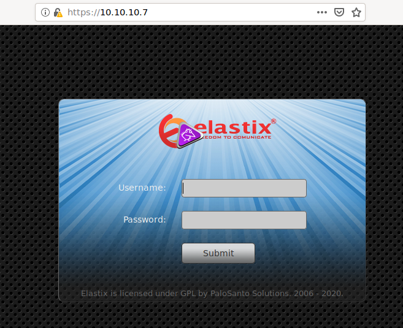
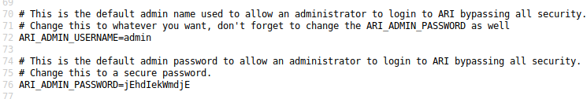

---
layout: post
title: HackTheBox Beep (10.10.10.7) Writeup
description: >
  Hackthebox Beep Writeup
image: /assets/img/beep.png

**NMAP:**
```
root@37f72653a832:/# nmap -sC -sV -T4 -p- 10.10.10.7
Starting Nmap 7.80 ( https://nmap.org ) at 2020-05-15 00:58 UTC
Stats: 0:03:20 elapsed; 0 hosts completed (1 up), 1 undergoing Service Scan
Service scan Timing: About 100.00% done; ETC: 01:02 (0:00:00 remaining)
Nmap scan report for 10.10.10.7
Host is up (0.024s latency).
Not shown: 65519 closed ports
PORT      STATE SERVICE    VERSION
22/tcp    open  ssh        OpenSSH 4.3 (protocol 2.0)
| ssh-hostkey:
|   1024 ad:ee:5a:bb:69:37:fb:27:af:b8:30:72:a0:f9:6f:53 (DSA)
|_  2048 bc:c6:73:59:13:a1:8a:4b:55:07:50:f6:65:1d:6d:0d (RSA)
25/tcp    open  smtp       Postfix smtpd
|_smtp-commands: beep.localdomain, PIPELINING, SIZE 10240000, VRFY, ETRN, ENHANCEDSTATUSCODES, 8BITMIME, DSN,
80/tcp    open  http       Apache httpd 2.2.3
|_http-server-header: Apache/2.2.3 (CentOS)
|_http-title: Did not follow redirect to https://10.10.10.7/
|_https-redirect: ERROR: Script execution failed (use -d to debug)
110/tcp   open  pop3       Cyrus pop3d 2.3.7-Invoca-RPM-2.3.7-7.el5_6.4
|_pop3-capabilities: IMPLEMENTATION(Cyrus POP3 server v2) APOP STLS PIPELINING USER RESP-CODES UIDL AUTH-RESP-CODE EXPIRE(NEVER) LOGIN-DELAY(0) TOP
111/tcp   open  rpcbind    2 (RPC #100000)
143/tcp   open  imap       Cyrus imapd 2.3.7-Invoca-RPM-2.3.7-7.el5_6.4
|_imap-capabilities: Completed CHILDREN RIGHTS=kxte UNSELECT QUOTA OK RENAME X-NETSCAPE ACL LISTEXT BINARY IMAP4rev1 IDLE ATOMIC CONDSTORE CATENATE THREAD=REFERENCES IMAP4 ID URLAUTHA0001
LITERAL+ STARTTLS THREAD=ORDEREDSUBJECT SORT=MODSEQ SORT MAILBOX-REFERRALS MULTIAPPEND NAMESPACE UIDPLUS NO ANNOTATEMORE LIST-SUBSCRIBED
443/tcp   open  ssl/https?
|_ssl-date: 2020-05-15T01:03:54+00:00; +1m09s from scanner time.
879/tcp   open  status     1 (RPC #100024)
993/tcp   open  ssl/imap   Cyrus imapd
|_imap-capabilities: CAPABILITY
995/tcp   open  pop3       Cyrus pop3d
3306/tcp  open  mysql      MySQL (unauthorized)
4190/tcp  open  sieve      Cyrus timsieved 2.3.7-Invoca-RPM-2.3.7-7.el5_6.4 (included w/cyrus
imap)
4445/tcp  open  upnotifyp?
4559/tcp  open  hylafax    HylaFAX 4.3.10
5038/tcp  open  asterisk   Asterisk Call Manager 1.1
10000/tcp open  http       MiniServ 1.570 (Webmin httpd)
|_http-server-header: MiniServ/1.570
|_http-title: Site doesn't have a title (text/html; Charset=iso-8859-1).
Service Info: Hosts:  beep.localdomain, 127.0.0.1, example.com, localhost; OS: Unix

Host script results:
|_clock-skew: 1m08s

Service detection performed. Please report any incorrect results at https://nmap.org/submit/ .
Nmap done: 1 IP address (1 host up) scanned in 392.16 seconds
```
**PORT 443:**

Gobuster:
```
/index.php (Status: 200)
/images (Status: 301)
/help (Status: 301)
/register.php (Status: 200)
/themes (Status: 301)
/modules (Status: 301)
/mail (Status: 301)
/admin (Status: 301)
/static (Status: 301)
/lang (Status: 301)
/config.php (Status: 200)
/robots.txt (Status: 200)
/var (Status: 301)
/panel (Status: 301)
```
Homepage:


Checking for exploits related to elastix there are a few but I will use [this LFI epxloit](https://www.exploit-db.com/exploits/37637)

That reveals a configuration file with some credentials in it



Using the credentials `admin;jEhdIekWmdjE` I can ssh in as the root user.
```
root@37f72653a832:/# ssh -oKexAlgorithms=+diffie-hellman-group1-sha1 root@10.10.10.7
root@10.10.10.7's password:
Last login: Fri May 15 04:33:29 2020 from 10.10.14.37

Welcome to Elastix
----------------------------------------------------

To access your Elastix System, using a separate workstation (PC/MAC/Linux)
Open the Internet Browser using the following URL:
http://10.10.10.7

[root@beep ~]#
```
From here I can read the `user.txt` and `root.txt` flags
```
[root@beep ~]# cat /home/fanis/user.txt
aeff3ddf0c765c2677b94715cffa73ac
[root@beep ~]# cat root.txt
d88e016123842106982acce0aaf453f0
```
